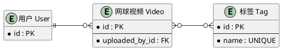

# Model Design

## 1. 设计范围

本设计覆盖 `videos` 应用当前视频上传功能所需的数据模型，包括：

- `Video`
- `Tag`
- `User`：复用 Django 用户模型，通过 `settings.AUTH_USER_MODEL` 引用

> 本文档用于明确数据模型的职责、字段、实体关系、约束及必要的初始数据设计，作为后续实现 `models.py` 和数据库迁移的依据。

---

## 2. Model 概览


| Model   | 来源              | 职责                                                    |
| ------- | --------------- | ----------------------------------------------------- |
| `Video` | 当前 `videos` app | 保存用户上传的网球视频、用户填写的业务信息以及系统提取的视频技术元数据                   |
| `Tag`   | 当前 `videos` app | 保存可复用的视频标签                                            |
| `User`  | Django 用户模型     | 表示视频上传用户，通过 `settings.AUTH_USER_MODEL` 与 `Video` 建立关系 |


> `User` 为复用模型，本设计不重新定义其用户名、密码等内部字段。

---


## 3. Model 详细设计


### 3.1 `Video`

`Video` 表示用户上传到系统中的一条网球视频记录。

---


#### 核心业务字段

> 核心业务字段用于描述视频本身以及用户填写的业务信息。


| 字段               | 业务含义                 | Django Field                | 参数                                                                  | 验证 / 约束                                   |
| ---------------- | -------------------- | --------------------------- | ------------------------------------------------------------------- | ----------------------------------------- |
| `id`             | 视频记录的唯一标识            | Django 自动生成主键               | 默认配置                                                                | 由 Django 主键机制保证唯一                         |
| `file`           | 用户上传的视频文件            | `FileField`                 | `upload_to=video_upload_path`                                       | 文件不能为空；仅允许 `.mp4`、`.mov`；最大 2 GB          |
| `player_count`   | 视频主要网球活动中实际参与击球的球员数量 | `PositiveSmallIntegerField` | `blank=False, null=False`                                           | `1 <= player_count <= 4`；不包括教练、裁判、观众和场边人员 |
| `camera_shaking` | 相机是否发生晃动             | `BooleanField`              | `blank=False, null=False`                                           | 用户必须明确选择“是”或“否”，不设置业务默认值                  |
| `viewpoint`      | 视频的拍摄视角              | `CharField`                 | `max_length=16, choices=Viewpoint.choices, blank=False, null=False` | 只能使用 `Viewpoint` 中定义的枚举值                  |
| `created_at`     | 视频上传时间               | `DateTimeField`             | `auto_now_add=True`                                                 | 创建视频记录时自动生成，不允许用户修改                       |


---


#### 实体关系字段

> 实体关系字段用于描述 `Video` 与其他实体之间的关系。


| 字段            | 业务含义     | Django 实现         | 参数                                                                                                            | 验证 / 约束                        |
| ------------- | -------- | ----------------- | ------------------------------------------------------------------------------------------------------------- | ------------------------------ |
| `uploaded_by` | 上传该视频的用户 | `ForeignKey`      | `settings.AUTH_USER_MODEL, on_delete=models.PROTECT, related_name="uploaded_videos", blank=False, null=False` | 创建视频时必须存在上传用户；用户存在已上传视频时禁止物理删除 |
| `tags`        | 视频拥有的标签  | `ManyToManyField` | `Tag, blank=True, related_name="videos"`                                                                      | 视频可以没有标签，也可以拥有多个标签；所选标签必须已经存在  |


---


#### 文件技术元数据

> 文件技术元数据用于描述上传文件本身的技术属性，由系统读取或提取，而不是由用户手动填写。


| 字段                 | 业务含义         | Django Field              | 参数                                                      | 验证 / 约束                                           |
| ------------------ | ------------ | ------------------------- | ------------------------------------------------------- | ------------------------------------------------- |
| `file_size_bytes`  | 视频文件大小，单位为字节 | `PositiveBigIntegerField` | `blank=False, null=False`                               | `0 < file_size_bytes <= 2 GiB`                    |
| `duration`         | 视频时长         | `DurationField`           | `blank=True, null=True`                                 | 元数据提取前允许为空；存在时必须大于 `0`                            |
| `container_format` | 视频容器格式       | `CharField`               | `max_length=16, blank=True, null=True`                  | 元数据提取前允许为空；保存系统识别后的规范化格式名称                        |
| `width_pixels`     | 视频画面宽度，单位为像素 | `PositiveIntegerField`    | `blank=True, null=True`                                 | 元数据提取前允许为空；存在时必须大于 `0`                            |
| `height_pixels`    | 视频画面高度，单位为像素 | `PositiveIntegerField`    | `blank=True, null=True`                                 | 元数据提取前允许为空；存在时必须大于 `0`                            |
| `frame_rate`       | 视频帧率，单位为 FPS | `DecimalField`            | `max_digits=6, decimal_places=3, blank=True, null=True` | 元数据提取前允许为空；存在时必须大于 `0`                            |
| `video_codec`      | 视频流使用的编码格式   | `CharField`               | `max_length=32, blank=True, null=True`                  | 元数据提取前允许为空；保存规范化编码名称，例如 `h264`、`hevc`、`vp9`、`av1` |


---


#### 文件存储路径设计

`file` 使用自定义 `upload_to` callable：

```python
from pathlib import Path
from uuid import uuid4

from django.utils import timezone


def video_upload_path(instance, filename):
    ext = Path(filename).suffix.lower()
    now = timezone.now()

    return f"videos/originals/{now:%Y/%m}/{uuid4().hex}{ext}"
```

存储路径格式：

```text
videos/originals/YYYY/MM/<uuid>.<extension>
```

例如：

```text
videos/originals/2026/08/a82f05c31fd34d11858f6069edcc1abe.mp4
```

设计目的：

- `videos/`：标识视频资源。
- `originals/`：标识用户上传的原始视频。
- `YYYY/MM`：按时间划分存储路径。
- `UUID`：避免用户文件名冲突。
- 保留原文件扩展名，并统一转换为小写。

---


#### 枚举设计


##### `viewpoint`

用途：

> 描述视频录制设备相对于网球场的拍摄视角。

```python
class Viewpoint(models.TextChoices):
    GROUND = "ground", "地板视角"
    TRIPOD = "tripod", "支架视角"
    HIGH = "high", "高位摄像机视角"
```

其中：

- `ground`：数据库值，对应地板视角。
- `tripod`：数据库值，对应支架视角。
- `high`：数据库值，对应高位摄像机视角。

数据库保存稳定的英文值，用户界面显示对应中文文本。

---


#### 约束与验证

简单的单字段验证直接通过 Django Field 参数或 Validator 实现。

##### 视频文件扩展名

允许：

- `mp4`
- `mov`

使用：

```python
FileExtensionValidator(
    allowed_extensions=["mp4", "mov"]
)
```

> 文件扩展名验证只作为第一层校验。系统后续仍需要通过媒体解析工具检查文件是否为有效视频以及真实的媒体格式。


##### 视频文件大小

定义：

```python
MAX_VIDEO_SIZE_BYTES = 2 * 1024 * 1024 * 1024
```

即单个视频最大：

```text
2 GiB
```

文件上传时使用自定义 Validator：

```python
def validate_video_size(file):
    if file.size > MAX_VIDEO_SIZE_BYTES:
        raise ValidationError(
            "视频文件大小不能超过 2 GB。"
        )
```

`file_size_bytes` 同时使用：

```python
validators=[
    MinValueValidator(1),
    MaxValueValidator(MAX_VIDEO_SIZE_BYTES),
]
```


##### `player_count`

```python
validators=[
    MinValueValidator(1),
    MaxValueValidator(4),
]
```


##### `duration`

```python
validators=[
    MinValueValidator(timedelta(microseconds=1))
]
```


##### `width_pixels`

```python
validators=[
    MinValueValidator(1)
]
```


##### `height_pixels`

```python
validators=[
    MinValueValidator(1)
]
```


##### `frame_rate`

```python
validators=[
    MinValueValidator(Decimal("0.001"))
]
```

当前没有已经确认的跨字段约束或额外的 Model-level validation。

---


#### Meta 设计

当前无额外 `Meta` 配置。

---


### 3.2 `Tag`

`Tag` 表示可以被多个视频复用的视频标签。

---


#### 核心业务字段


| 字段     | 业务含义      | Django Field  | 参数                                                    | 验证 / 约束           |
| ------ | --------- | ------------- | ----------------------------------------------------- | ----------------- |
| `id`   | 标签记录的唯一标识 | Django 自动生成主键 | 默认配置                                                  | 由 Django 主键机制保证唯一 |
| `name` | 标签名称      | `CharField`   | `max_length=50, unique=True, blank=False, null=False` | 名称不能为空；不同标签名称不能重复 |


---


#### 约束与验证

`name` 的最大长度为：

```text
50
```

唯一性通过：

```python
unique=True
```

实现。

当前没有额外的跨字段约束或 Model-level validation。

---


#### Meta 设计

当前无额外 `Meta` 配置。

---


## 4. 实体关系总览

> 本节用于从整个 `videos` app 的角度汇总实体之间的关系。
>
> 各关系字段的具体参数以对应 Model 的“实体关系字段”章节为准。


| 实体 A    | 实体 B    | 关系  | 字段位置                | Django 实现                                                                                        | 删除规则                                  |
| ------- | ------- | --- | ------------------- | ------------------------------------------------------------------------------------------------ | ------------------------------------- |
| `User`  | `Video` | 一对多 | `Video.uploaded_by` | `ForeignKey(settings.AUTH_USER_MODEL, on_delete=models.PROTECT, related_name="uploaded_videos")` | 用户存在已上传视频时，不允许物理删除用户；可以停用账号           |
| `Video` | `Tag`   | 多对多 | `Video.tags`        | `ManyToManyField(Tag, blank=True, related_name="videos")`                                        | 删除关联时仅删除中间关系记录，不删除 `Video` 或 `Tag` 实体 |


---


## 5. 初始数据设计


### `Tag`

系统需要预置以下标签：

- 拉球
- 比赛
- 多球练习

这些数据属于 `Tag` 表中的初始数据库记录，不是 `name` 字段的默认值。

初始化方式：

```text
Data Migration
```

在创建 `Tag` 数据表后，通过 Django Data Migration 创建上述记录，使不同开发环境和部署环境拥有一致的初始标签数据。

---


## 6. ER 图



---


## 7. 设计检查

- [x] 当前功能需要持久化的数据实体已经全部识别。
- [x] 每个 Model 的职责清晰，没有明显职责重叠。
- [x] 每个字段都有明确的业务含义。
- [x] 业务字段与文件技术元数据已经区分。
- [x] 每个关系都明确了关系类型和字段所在位置。
- [x] `ForeignKey` 已明确 `on_delete` 策略。
- [x] `related_name` 已检查并明确。
- [x] 可选字段的 `blank` / `null` 策略已经明确。
- [x] `viewpoint` 已明确数据库值与展示值。
- [x] 视频文件存储路径规则已经明确。
- [x] 视频允许上传的文件格式已经确定为 `.mp4`、`.mov`。
- [x] 视频最大上传大小已经确定为 2 GiB。
- [x] `player_count` 范围已经确定为 `1–4`。
- [x] `Tag.name.max_length` 已确定为 `50`。
- [x] `frame_rate` 已确定为 `max_digits=6, decimal_places=3`。
- [x] 简单字段 Validator 的具体实现方式已经明确。
- [x] 当前没有需要额外设计的跨字段或 Model-level 约束。
- [x] 当前没有额外 `Meta` 配置需求。
- [x] 需要预置的 `Tag` 数据及初始化方式已经明确。
- [x] ER 图与实体关系总览保持一致。
- [x] 本设计已经能够直接指导后续 `models.py` 实现。