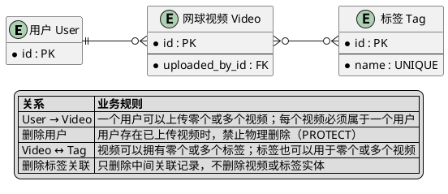

# 当前项目的实体关系表

| 实体 A | 实体 B | 关系 | 业务规则 | Django 实现 | 删除规则 |
|---|---|---|---|---|---|
| 用户 | 网球视频 | 一对多 | 一个用户可以上传零个或多个视频；每个视频必须属于一个上传用户 | 在 `Video` 中添加 `ForeignKey(settings.AUTH_USER_MODEL, on_delete=models.PROTECT, related_name="uploaded_videos")` | 用户存在已上传视频时，不允许物理删除用户；可以停用账号 |
| 网球视频 | 标签 | 多对多 | 一个视频可以没有标签，也可以拥有多个标签；一个标签可以用于零个或多个视频 | 在 `Video` 中添加 `ManyToManyField(Tag, blank=True, related_name="videos")` | 删除关联时不删除视频或标签实体；只删除中间关联记录 |

# ER图

